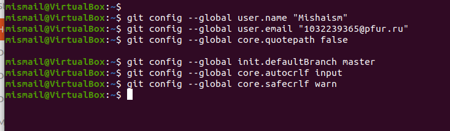
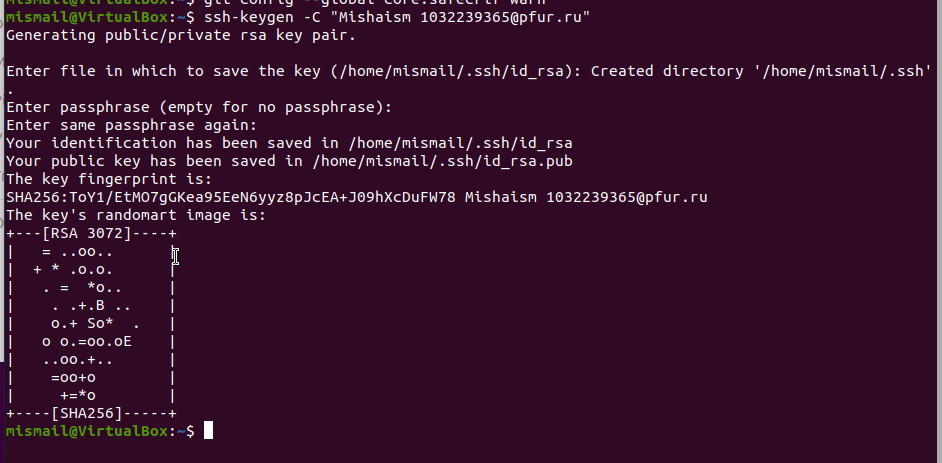
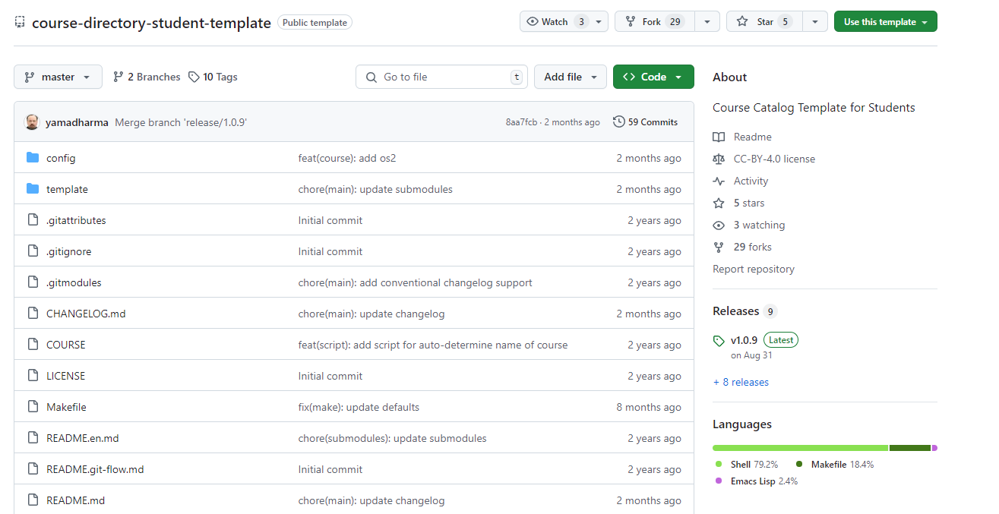
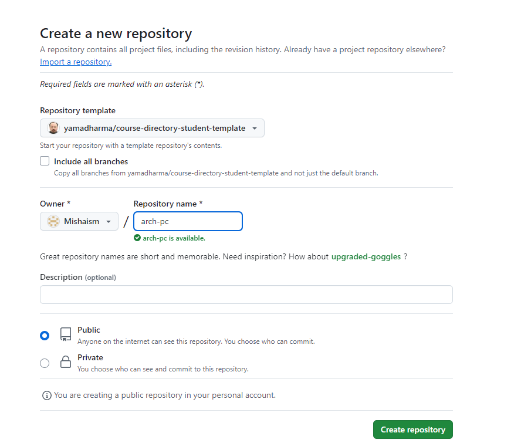
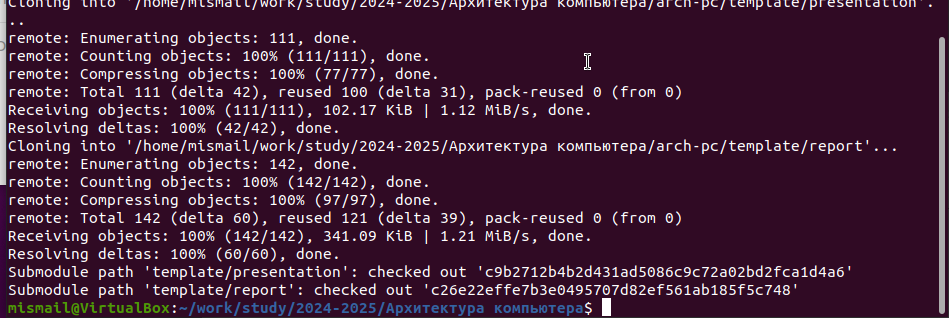
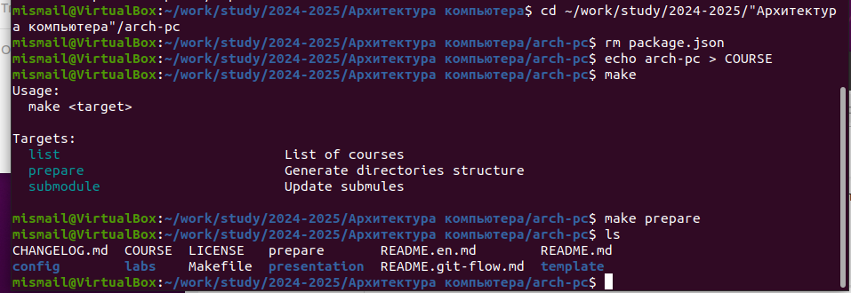
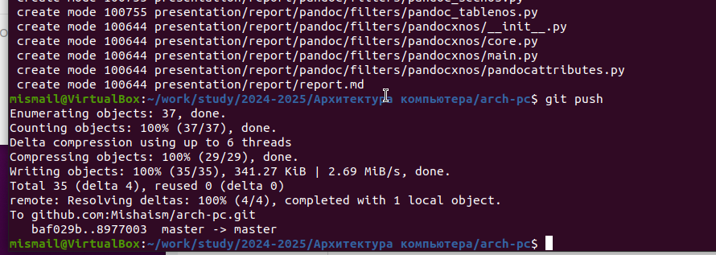
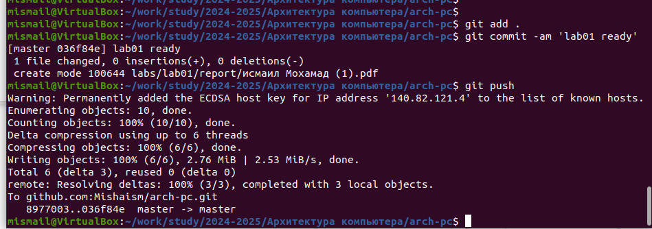
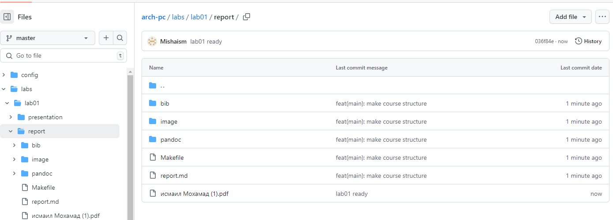

---
## Front matter
title: "Отчёт по лабораторной работе 2"
subtitle: "Архитектура компьютеров"
author: "Исмаил М. А. НКАбд-03-24"

## Generic otions
lang: ru-RU
toc-title: "Содержание"

## Bibliography
bibliography: bib/cite.bib
csl: pandoc/csl/gost-r-7-0-5-2008-numeric.csl

## Pdf output format
toc: true # Table of contents
toc-depth: 2
lof: true # List of figures
lot: true # List of tables
fontsize: 12pt
linestretch: 1.5
papersize: a4
documentclass: scrreprt
## I18n polyglossia
polyglossia-lang:
  name: russian
  options:
	- spelling=modern
	- babelshorthands=true
polyglossia-otherlangs:
  name: english
## I18n babel
babel-lang: russian
babel-otherlangs: english
## Fonts
mainfont: PT Serif
romanfont: PT Serif
sansfont: PT Sans
monofont: PT Mono
mainfontoptions: Ligatures=TeX
romanfontoptions: Ligatures=TeX
sansfontoptions: Ligatures=TeX,Scale=MatchLowercase
monofontoptions: Scale=MatchLowercase,Scale=0.9
## Biblatex
biblatex: true
biblio-style: "gost-numeric"
biblatexoptions:
  - parentracker=true
  - backend=biber
  - hyperref=auto
  - language=auto
  - autolang=other*
  - citestyle=gost-numeric
## Pandoc-crossref LaTeX customization
figureTitle: "Рис."
tableTitle: "Таблица"
listingTitle: "Листинг"
lofTitle: "Список иллюстраций"
lotTitle: "Список таблиц"
lolTitle: "Листинги"
## Misc options
indent: true
header-includes:
  - \usepackage{indentfirst}
  - \usepackage{float} # keep figures where there are in the text
  - \floatplacement{figure}{H} # keep figures where there are in the text
---

# Цель работы

Целью работы является изучить идеологию и применение средств контроля версий. Приобрести практические навыки по работе с системой git.

# Теоретическое введение

## Системы контроля версий. Общие понятия

Системы контроля версий (Version Control System, VCS) применяются при работе
нескольких человек над одним проектом. Обычно основное дерево проекта хранится в
локальном или удалённом репозитории, к которому настроен доступ для участников проекта. При внесении изменений в содержание проекта система контроля версий позволяет
их фиксировать, совмещать изменения, произведённые разными участниками проекта,
производить откат к любой более ранней версии проекта, если это требуется.

В классических системах контроля версий используется централизованная модель, предполагающая наличие единого репозитория для хранения файлов. Выполнение большинства
функций по управлению версиями осуществляется специальным сервером. Участник проекта (пользователь) перед началом работы посредством определённых команд получает
нужную ему версию файлов. После внесения изменений, пользователь размещает новую
версию в хранилище. При этом предыдущие версии не удаляются из центрального хранилища и к ним можно вернуться в любой момент. Сервер может сохранять не полную версию
изменённых файлов, а производить так называемую дельта-компрессию — сохранять только
изменения между последовательными версиями, что позволяет уменьшить объём хранимых
данных.

Системы контроля версий поддерживают возможность отслеживания и разрешения конфликтов, которые могут возникнуть при работе нескольких человек над одним файлом.
Можно объединить (слить) изменения, сделанные разными участниками (автоматически
или вручную), вручную выбрать нужную версию, отменить изменения вовсе или заблокировать файлы для изменения. В зависимости от настроек блокировка не позволяет другим
пользователям получить рабочую копию или препятствует изменению рабочей копии файла
средствами файловой системы ОС, обеспечивая таким образом, привилегированный доступ
только одному пользователю, работающему с файлом.

# Выполнение лабораторной работы

## Настройка github

Сначала настраиваю Git на своем компьютере. Создаю пользователя в системе Git и указываю параметры — имя и email, 
чтобы мои действия были правильно подписаны. (рис. [-@fig:001])

{ #fig:001 width=70%, height=70% }

Генерирую SSH-ключи, которые нужны для идентификации на GitHub. (рис. [-@fig:002]) 
Сохраняю их на компьютере и добавляю публичный 
ключ в свой профиль на GitHub для установления связи. (рис. [-@fig:003])

{ #fig:002 width=70%, height=70% }

{ #fig:003 width=70%, height=70% }

## Сознание репозитория курса на основе шаблона

Нахожу нужный репозиторий-шаблон (рис. [-@fig:004]) 
и делаю из него копию для работы (рис. [-@fig:005]).

{ #fig:004 width=70%, height=70% }

{ #fig:005 width=70%, height=70% }

## Настройка каталога курса

Создаю рабочую директорию на своем компьютере для хранения файлов проекта. Клонирую репозиторий с 
GitHub в эту директорию, чтобы работать с файлами локально. (рис. [-@fig:006]) (рис. [-@fig:007]) 

{ #fig:006 width=70%, height=70% }

{ #fig:007 width=70%, height=70% }

После подготовки структуры добавляю изменения в локальный репозиторий и отправляю их на 
GitHub командой push. (рис. [-@fig:008])

{ #fig:008 width=70%, height=70% }

## Задание для самостоятельной работы

Загружаю отчёты по выполненным работам в соответствующие папки на GitHub, 
обновляя репозиторий по мере необходимости. (рис. [-@fig:009]) (рис. [-@fig:010])

{ #fig:009 width=70%, height=70% }

{ #fig:010 width=70%, height=70% }

# Выводы

В ходе выполнения работы изучили работу с GitHub.

# Список литературы{.unnumbered}

1. Архитектура ЭВМ - Материалы курса

2. Markdown Документация

3. GitHub Документация
